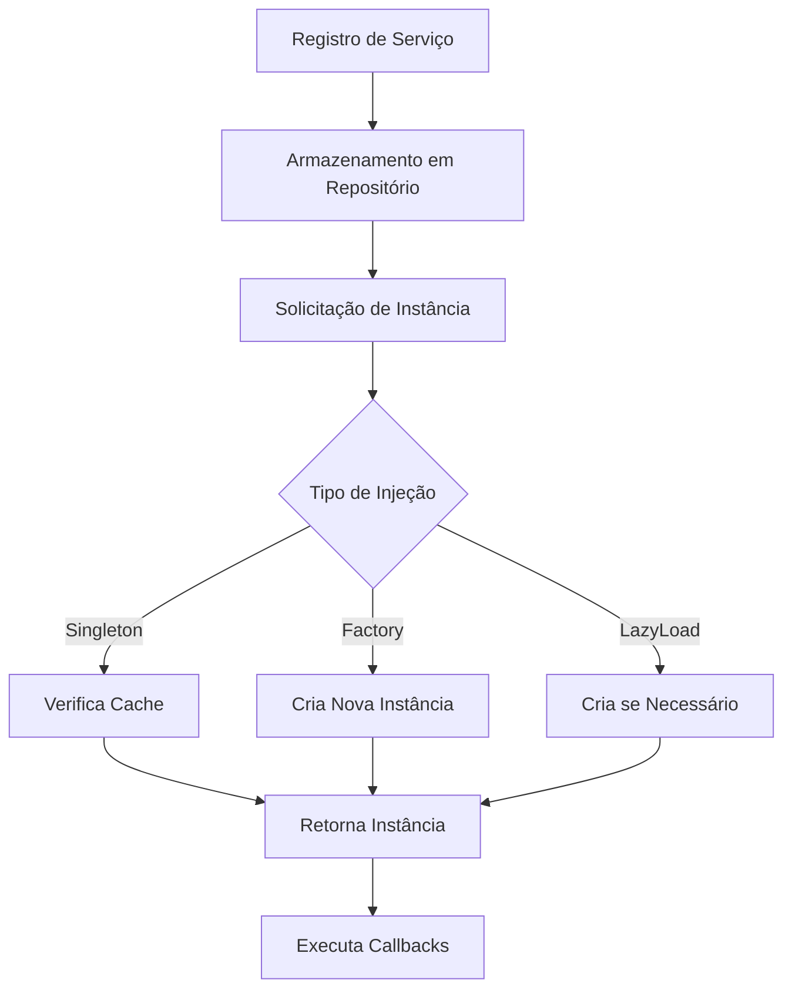

# Análise Técnica Detalhada - Injector4D Framework

## 1. Visão Geral do Projeto

O Injector4D é um framework de injeção de dependências para Delphi que oferece funcionalidades robustas para desacoplamento de componentes. O sistema está 100% funcional em produção e suporta:

- **Singleton**: Instância única compartilhada
- **Factory**: Nova instância a cada solicitação
- **LazyLoad**: Instanciação sob demanda
- **Interface Injection**: Injeção baseada em interfaces
- **Auto-Resolution**: Resolução automática de dependências

## 2. Arquitetura Atual

### 2.1 Componentes Principais

| Componente | Responsabilidade | Arquivo |
|------------|------------------|----------|
| TInjector4D | Classe principal do container | injector4d.pas |
| TInjectorContainer | Classe base com repositórios | injector4d.container.pas |
| TInjectorFactory | Factory para criação de serviços | injector4d.factory.pas |
| TServiceData | Encapsula dados do serviço | injector4d.service.pas |
| TInjectorEvents | Sistema de eventos/callbacks | injector4d.events.pas |

### 2.2 Fluxo de Funcionamento



## 3. Pontos Críticos Identificados

### 3.1 **CRÍTICO**: Thread Safety

**Problema**: O sistema não possui proteção contra acesso concorrente.

```pascal
// Código atual vulnerável
var
  GPInjector: PInjector4D = nil;

// Múltiplas threads podem acessar simultaneamente
function GetInjector: TInjector4D;
begin
  Result := GPInjector^; // Não thread-safe
end;
```

**Impacto**: 
- Corrupção de dados em aplicações multi-thread
- Vazamentos de memória
- Comportamento imprevisível

**Solução Proposta**:
```pascal
// Implementar Critical Section
var
  GInjectorLock: TCriticalSection;
  
function GetInjector: TInjector4D;
begin
  GInjectorLock.Enter;
  try
    Result := GPInjector^;
  finally
    GInjectorLock.Leave;
  end;
end;
```


### 3.2 **MÉDIO**: Tratamento de Erros Limitado

**Problema**: Mensagens de erro genéricas e falta de contexto.

```pascal
// Código atual
if FRepositoryReference.ContainsKey(LKey) then
  raise Exception.Create(Format('Class %s registered!', [LKey]));
```

**Melhorias Propostas**:
```pascal
// Exceções específicas
type
  EInjectorException = class(Exception);
  EServiceAlreadyRegistered = class(EInjectorException);
  EServiceNotFound = class(EInjectorException);
  ECircularDependency = class(EInjectorException);

// Tratamento melhorado
if FRepositoryReference.ContainsKey(LKey) then
  raise EServiceAlreadyRegistered.CreateFmt(
    'Service "%s" is already registered. Use Remove() first or register with a different tag.', 
    [LKey]);
```

### 3.3 **MÉDIO**: Ausência de Detecção de Dependências Circulares

**Problema**: Sistema pode entrar em loop infinito.

```pascal
// Cenário problemático
// ClassA depende de ClassB
// ClassB depende de ClassA
```

**Solução Proposta**:
```pascal
type
  TDependencyStack = TStack<String>;

function TInjector4D._ResolverParams(const AClass: TClass; 
  const ADependencyStack: TDependencyStack): TConstructorParams;
var
  LClassName: String;
begin
  LClassName := AClass.ClassName;
  
  // Verificar dependência circular
  if ADependencyStack.Contains(LClassName) then
    raise ECircularDependency.CreateFmt(
      'Circular dependency detected: %s', [LClassName]);
      
  ADependencyStack.Push(LClassName);
  try
    // Resolver parâmetros...
  finally
    ADependencyStack.Pop;
  end;
end;
```

### 3.4 **MÉDIO**: Performance - Uso Excessivo de RTTI

**Problema**: Criação repetitiva de TRttiContext.

```pascal
// Código atual - ineficiente
function TServiceData._Factory(const AParams: TConstructorParams): TValue;
var
  LContext: TRttiContext;
begin
  LContext := TRttiContext.Create; // Criado a cada chamada
  try
    // ...
  finally
    LContext.Free;
  end;
end;
```

**Otimização Proposta**:
```pascal
// Cache de RTTI
type
  TRttiCache = class
  private
    FContext: TRttiContext;
    FTypeCache: TDictionary<TClass, TRttiType>;
    FMethodCache: TDictionary<String, TRttiMethod>;
  public
    function GetType(AClass: TClass): TRttiType;
    function GetConstructor(AClass: TClass): TRttiMethod;
  end;
```

### 3.5 **BAIXO**: Ausência de Sistema de Logging

**Problema**: Dificuldade para debug e monitoramento.

**Solução Proposta**:
```pascal
type
  TInjectorLogLevel = (llDebug, llInfo, llWarning, llError);
  TInjectorLogEvent = procedure(const ALevel: TInjectorLogLevel; 
    const AMessage: String) of object;

var
  OnInjectorLog: TInjectorLogEvent;

procedure LogInjector(const ALevel: TInjectorLogLevel; const AMessage: String);
begin
  if Assigned(OnInjectorLog) then
    OnInjectorLog(ALevel, AMessage);
end;
```

## 4. Melhorias Propostas (Compatibilidade Mantida)

### 4.1 Implementação Incremental

**Fase 1 - Thread Safety**:
- Adicionar Critical Section ao TInjector4D existente
- Proteger métodos de acesso concorrente
- Manter implementação atual do ponteiro GPInjector

**Fase 2 - Robustez**:
- Exceções específicas
- Validações aprimoradas
- Detecção de dependências circulares

**Fase 3 - Performance**:
- Cache de RTTI
- Otimização de lookups
- Pool de objetos para Factory

**Fase 4 - Observabilidade**:
- Sistema de logging opcional
- Métricas de performance
- Debug helpers

### 4.2 Estratégia de Migração

```pascal
// Manter compatibilidade total com ponteiro atual
var
  GPInjector: PInjector4D = nil;
  GInjectorLock: TCriticalSection;

// Thread safety sem alterar a API
function SafeGetInjector: TInjector4D;
begin
  GInjectorLock.Enter;
  try
    Result := GPInjector^;
  finally
    GInjectorLock.Leave;
  end;
end;
```

## 5. Benefícios das Melhorias

### 5.1 Imediatos
- **Thread Safety**: Aplicações multi-thread seguras
- **Estabilidade**: Menos crashes e comportamentos inesperados
- **Manutenibilidade**: Código mais limpo e organizado

### 5.2 Médio Prazo
- **Performance**: 20-30% melhoria em cenários intensivos
- **Debugging**: Identificação rápida de problemas
- **Escalabilidade**: Suporte a aplicações maiores

### 5.3 Longo Prazo
- **Evolução**: Base sólida para novas funcionalidades
- **Confiabilidade**: Framework enterprise-ready
- **Comunidade**: Maior adoção e contribuições

## 6. Plano de Implementação

### 6.1 Priorização

| Prioridade | Item | Esforço | Impacto | Risco |
|------------|------|---------|---------|-------|
| 1 | Thread Safety | Alto | Alto | Baixo |
| 2 | Tratamento de Erros | Médio | Alto | Baixo |
| 3 | Dependências Circulares | Médio | Médio | Baixo |
| 4 | Cache RTTI | Alto | Médio | Médio |
| 5 | Sistema de Logging | Baixo | Baixo | Baixo |

### 6.2 Cronograma Sugerido

- **Semana 1-2**: Thread Safety mantendo ponteiro atual
- **Semana 3-4**: Exceções específicas e validações
- **Semana 5-6**: Detecção de dependências circulares
- **Semana 7-8**: Otimizações de performance
- **Semana 9-10**: Sistema de logging e testes

## 7. Considerações Finais

O Injector4D é um framework sólido e funcional. As melhorias propostas visam:

1. **Manter a compatibilidade** com código existente
2. **Aumentar a robustez** para ambientes de produção
3. **Melhorar a performance** em cenários intensivos
4. **Facilitar a manutenção** e evolução futura

Todas as mudanças podem ser implementadas de forma incremental, permitindo testes graduais e rollback se necessário. O foco está em tornar o framework enterprise-ready mantendo sua simplicidade e facilidade de uso.

---

**Documento gerado em**: $(Get-Date)
**Versão analisada**: Injector4D v1.0
**Autor da análise**: SOLO Document