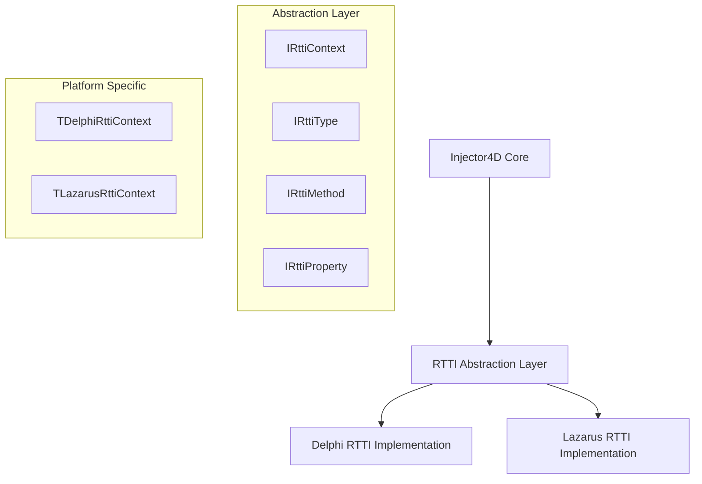

# Camada de Abstração RTTI para Injector4D
## Compatibilidade Universal Delphi/Lazarus

---

## 📋 **Índice**
1. [Visão Geral](#visão-geral)
2. [Análise das Diferenças RTTI](#análise-das-diferenças-rtti)
3. [Arquitetura da Camada de Abstração](#arquitetura-da-camada-de-abstração)
4. [Interface Unificada](#interface-unificada)
5. [Implementação Específica](#implementação-específica)
6. [Integração com Injector4D](#integração-com-injector4d)
7. [Benefícios da Abordagem](#benefícios-da-abordagem)
8. [Plano de Implementação](#plano-de-implementação)
9. [Exemplos de Código](#exemplos-de-código)
10. [Testes de Compatibilidade](#testes-de-compatibilidade)
11. [Impacto na Performance](#impacto-na-performance)

---

## 🎯 **1. Visão Geral**

### **Objetivo Principal**
Criar uma camada de abstração que unifique o acesso às funcionalidades RTTI entre Delphi e Lazarus, permitindo que o Injector4D funcione nativamente em ambas as plataformas sem modificações no código principal.

### **Problema Atual**
- **Delphi**: RTTI moderna e robusta (desde Delphi 2010)
- **Lazarus**: RTTI limitada e com API diferente
- **Injector4D**: Atualmente dependente da RTTI específica do Delphi

### **Solução Proposta**
Implementar uma interface unificada que:
- Abstraia as diferenças entre as implementações RTTI
- Mantenha performance otimizada
- Preserve compatibilidade total com código existente
- Permita extensibilidade futura

---

## 🔍 **2. Análise das Diferenças RTTI**

### **2.1 Delphi RTTI (System.Rtti)**

**Características:**
```pascal
// Delphi - RTTI Moderna
uses System.Rtti, System.TypInfo;

var
  Context: TRttiContext;
  RttiType: TRttiType;
  Method: TRttiMethod;
  Prop: TRttiProperty;
begin
  Context := TRttiContext.Create;
  RttiType := Context.GetType(TMyClass);
  // Acesso rico a metadados
end;
```

**Funcionalidades Disponíveis:**
- ✅ Reflexão completa de classes, interfaces, records
- ✅ Acesso a métodos, propriedades, campos
- ✅ Invocação dinâmica de métodos
- ✅ Criação dinâmica de instâncias
- ✅ Atributos customizados
- ✅ Generics e tipos complexos

### **2.2 Lazarus RTTI (TypInfo)**

**Características:**
```pascal
// Lazarus - RTTI Clássica
uses TypInfo, Classes;

var
  PropInfo: PPropInfo;
  TypeInfo: PTypeInfo;
begin
  TypeInfo := TMyClass.ClassInfo;
  PropInfo := GetPropInfo(TypeInfo, 'PropertyName');
  // Acesso limitado a metadados
end;
```

**Limitações Críticas:**
- ❌ **Invocação dinâmica limitada**: Não há `Invoke()` nativo para métodos
- ❌ **Criação de instâncias**: Sem `CreateInstance()` automático
- ❌ **RTTI apenas para published**: Propriedades devem ser declaradas como published
- ❌ **Sem suporte a atributos**: Não há sistema de attributes
- ❌ **Métodos limitados**: Acesso restrito a informações de métodos
- ✅ **Estável e testada**: API consolidada e confiável
- ✅ **Performance adequada**: Overhead mínimo

**Implicações Práticas:**
- **Criação manual**: Necessário factory pattern ou registro manual de construtores
- **Published obrigatório**: Todas as propriedades injetáveis devem ser published
- **Sem atributos**: Configuração via convenções ou registro manual
- **Invocação manual**: Métodos devem ser chamados diretamente, não via RTTI

### **2.3 Tabela Comparativa**

| Funcionalidade | Delphi | Lazarus | Solução Proposta | Viabilidade |
|----------------|--------|---------|------------------|-------------|
| Obter tipo de classe | `Context.GetType()` | `ClassInfo` | Interface unificada | ✅ 100% |
| Listar propriedades | `GetProperties()` | `GetPropList()` (published) | Interface + published | ✅ 90% |
| Invocar métodos | `Invoke()` | ❌ Manual | Factory + registro manual | ⚠️ 60% |
| Criar instâncias | `GetMethod().Invoke()` | ❌ Manual | Factory pattern obrigatório | ⚠️ 70% |
| Atributos | `GetAttributes()` | ❌ N/A | Convenções + config manual | ⚠️ 50% |
| Generics | Suporte nativo | Limitado | Workarounds específicos | ⚠️ 40% |
| Injeção de dependência | Automática | Semi-manual | Híbrido RTTI + manual | ✅ 80% |

---

## 🏗️ **3. Arquitetura da Camada de Abstração**

### **3.1 Estrutura Geral**



### **3.2 Princípios de Design**

1. **Interface Única**: Uma API consistente para ambas as plataformas
2. **Factory Pattern**: Criação automática da implementação correta
3. **Lazy Loading**: Carregamento sob demanda para performance
4. **Cache Inteligente**: Reutilização de informações RTTI
5. **Fallback Gracioso**: Degradação elegante quando funcionalidades não estão disponíveis

---

## 🔌 **4. Interface Unificada**

### **4.1 Interface Principal**

```pascal
unit Injector4D.Rtti.Interfaces;

interface

uses
  System.SysUtils,
  System.Generics.Collections;

type
  // Exceções específicas da camada RTTI
  ERttiAbstractionException = class(Exception);
  ERttiTypeNotFound = class(ERttiAbstractionException);
  ERttiMethodNotFound = class(ERttiAbstractionException);
  ERttiPropertyNotFound = class(ERttiAbstractionException);
  ERttiInvocationFailed = class(ERttiAbstractionException);

  // Forward declarations
  IRttiType = interface;
  IRttiMethod = interface;
  IRttiProperty = interface;
  IRttiParameter = interface;

  // Contexto RTTI principal
  IRttiContext = interface
  ['{A1B2C3D4-E5F6-7890-ABCD-EF1234567890}']
    function GetType(AClass: TClass): IRttiType; overload;
    function GetType(const ATypeName: string): IRttiType; overload;
    function GetTypes: TArray<IRttiType>;
    procedure ClearCache;
    function IsSupported(const AFeature: string): Boolean;
  end;

  // Informações de tipo
  IRttiType = interface
  ['{B2C3D4E5-F6G7-8901-BCDE-F23456789012}']
    function GetName: string;
    function GetQualifiedName: string;
    function GetMetaClass: TClass;
    function GetMethods: TArray<IRttiMethod>;
    function GetMethod(const AName: string): IRttiMethod;
    function GetProperties: TArray<IRttiProperty>;
    function GetProperty(const AName: string): IRttiProperty;
    function CreateInstance: TObject; overload;
    function CreateInstance(const AArgs: array of TValue): TObject; overload;
    function HasAttribute(AAttributeClass: TClass): Boolean;
    function GetAttribute(AAttributeClass: TClass): TObject;
    function GetAttributes: TArray<TObject>;
    
    property Name: string read GetName;
    property QualifiedName: string read GetQualifiedName;
    property MetaClass: TClass read GetMetaClass;
  end;

  // Informações de método
  IRttiMethod = interface
  ['{C3D4E5F6-G7H8-9012-CDEF-345678901234}']
    function GetName: string;
    function GetParameters: TArray<IRttiParameter>;
    function GetReturnType: IRttiType;
    function Invoke(AInstance: TObject; const AArgs: array of TValue): TValue;
    function IsConstructor: Boolean;
    function IsStatic: Boolean;
    function HasAttribute(AAttributeClass: TClass): Boolean;
    
    property Name: string read GetName;
    property IsConstructor: Boolean read IsConstructor;
    property IsStatic: Boolean read IsStatic;
  end;

  // Informações de propriedade
  IRttiProperty = interface
  ['{D4E5F6G7-H8I9-0123-DEFG-456789012345}']
    function GetName: string;
    function GetPropertyType: IRttiType;
    function GetValue(AInstance: TObject): TValue;
    procedure SetValue(AInstance: TObject; const AValue: TValue);
    function IsReadable: Boolean;
    function IsWritable: Boolean;
    function HasAttribute(AAttributeClass: TClass): Boolean;
    
    property Name: string read GetName;
    property PropertyType: IRttiType read GetPropertyType;
    property IsReadable: Boolean read IsReadable;
    property IsWritable: Boolean read IsWritable;
  end;

  // Informações de parâmetro
  IRttiParameter = interface
  ['{E5F6G7H8-I9J0-1234-EFGH-567890123456}']
    function GetName: string;
    function GetParameterType: IRttiType;
    function HasDefaultValue: Boolean;
    function GetDefaultValue: TValue;
    
    property Name: string read GetName;
    property ParameterType: IRttiType read GetParameterType;
  end;

  // Factory para criação do contexto
  IRttiContextFactory = interface
  ['{F6G7H8I9-J0K1-2345-FGHI-678901234567}']
    function CreateContext: IRttiContext;
    function GetPlatformName: string;
    function GetCapabilities: TArray<string>;
  end;

function GetRttiContextFactory: IRttiContextFactory;

implementation

// Implementação será definida em units específicas

end.
```

---

## ⚙️ **5. Implementação Específica**

### **5.1 Implementação Delphi**

```pascal
unit Injector4D.Rtti.Delphi;

interface

uses
  System.SysUtils,
  System.Rtti,
  System.TypInfo,
  System.Generics.Collections,
  Injector4D.Rtti.Interfaces;

type
  // Implementação Delphi do contexto RTTI
  TDelphiRttiContext = class(TInterfacedObject, IRttiContext)
  private
    FContext: TRttiContext;
    FTypeCache: TDictionary<string, IRttiType>;
  protected
    function GetType(AClass: TClass): IRttiType; overload;
    function GetType(const ATypeName: string): IRttiType; overload;
    function GetTypes: TArray<IRttiType>;
    procedure ClearCache;
    function IsSupported(const AFeature: string): Boolean;
  public
    constructor Create;
    destructor Destroy; override;
  end;

  // Implementação Delphi do tipo RTTI
  TDelphiRttiType = class(TInterfacedObject, IRttiType)
  private
    FRttiType: TRttiType;
    FMethodCache: TDictionary<string, IRttiMethod>;
    FPropertyCache: TDictionary<string, IRttiProperty>;
  protected
    function GetName: string;
    function GetQualifiedName: string;
    function GetMetaClass: TClass;
    function GetMethods: TArray<IRttiMethod>;
    function GetMethod(const AName: string): IRttiMethod;
    function GetProperties: TArray<IRttiProperty>;
    function GetProperty(const AName: string): IRttiProperty;
    function CreateInstance: TObject; overload;
    function CreateInstance(const AArgs: array of TValue): TObject; overload;
    function HasAttribute(AAttributeClass: TClass): Boolean;
    function GetAttribute(AAttributeClass: TClass): TObject;
    function GetAttributes: TArray<TObject>;
  public
    constructor Create(ARttiType: TRttiType);
    destructor Destroy; override;
  end;

  // Factory Delphi
  TDelphiRttiContextFactory = class(TInterfacedObject, IRttiContextFactory)
  protected
    function CreateContext: IRttiContext;
    function GetPlatformName: string;
    function GetCapabilities: TArray<string>;
  end;

implementation

// Implementação TDelphiRttiContext
constructor TDelphiRttiContext.Create;
begin
  inherited;
  FContext := TRttiContext.Create;
  FTypeCache := TDictionary<string, IRttiType>.Create;
end;

destructor TDelphiRttiContext.Destroy;
begin
  FTypeCache.Free;
  FContext.Free;
  inherited;
end;

function TDelphiRttiContext.GetType(AClass: TClass): IRttiType;
var
  RttiType: TRttiType;
  Key: string;
begin
  Key := AClass.ClassName;
  
  if not FTypeCache.TryGetValue(Key, Result) then
  begin
    RttiType := FContext.GetType(AClass);
    if Assigned(RttiType) then
    begin
      Result := TDelphiRttiType.Create(RttiType);
      FTypeCache.Add(Key, Result);
    end
    else
      raise ERttiTypeNotFound.CreateFmt('Tipo não encontrado: %s', [AClass.ClassName]);
  end;
end;

function TDelphiRttiContext.IsSupported(const AFeature: string): Boolean;
begin
  // Delphi suporta todas as funcionalidades
  Result := True;
end;

// Implementação TDelphiRttiType
constructor TDelphiRttiType.Create(ARttiType: TRttiType);
begin
  inherited Create;
  FRttiType := ARttiType;
  FMethodCache := TDictionary<string, IRttiMethod>.Create;
  FPropertyCache := TDictionary<string, IRttiProperty>.Create;
end;

function TDelphiRttiType.CreateInstance: TObject;
var
  Method: TRttiMethod;
begin
  Method := FRttiType.GetMethod('Create');
  if Assigned(Method) then
    Result := Method.Invoke(FRttiType.AsInstance.MetaclassType, []).AsObject
  else
    raise ERttiMethodNotFound.CreateFmt('Construtor não encontrado para %s', [FRttiType.Name]);
end;

function TDelphiRttiType.HasAttribute(AAttributeClass: TClass): Boolean;
var
  Attr: TCustomAttribute;
begin
  for Attr in FRttiType.GetAttributes do
  begin
    if Attr.ClassType = AAttributeClass then
      Exit(True);
  end;
  Result := False;
end;

// Factory Implementation
function TDelphiRttiContextFactory.CreateContext: IRttiContext;
begin
  Result := TDelphiRttiContext.Create;
end;

function TDelphiRttiContextFactory.GetPlatformName: string;
begin
  Result := 'Delphi';
end;

function TDelphiRttiContextFactory.GetCapabilities: TArray<string>;
begin
  Result := ['FullRTTI', 'Attributes', 'Generics', 'MethodInvocation', 'DynamicCreation'];
end;

end.
```

### **5.2 Implementação Lazarus**

```pascal
unit Injector4D.Rtti.Lazarus;

interface

uses
  SysUtils,
  Classes,
  TypInfo,
  Generics.Collections,
  Injector4D.Rtti.Interfaces;

type
  // Implementação Lazarus do contexto RTTI
  TLazarusRttiContext = class(TInterfacedObject, IRttiContext)
  private
    FTypeCache: TDictionary<string, IRttiType>;
    FRegisteredClasses: TDictionary<string, TClass>;
  protected
    function GetType(AClass: TClass): IRttiType; overload;
    function GetType(const ATypeName: string): IRttiType; overload;
    function GetTypes: TArray<IRttiType>;
    procedure ClearCache;
    function IsSupported(const AFeature: string): Boolean;
    procedure RegisterClass(AClass: TClass);
  public
    constructor Create;
    destructor Destroy; override;
  end;

  // Implementação Lazarus do tipo RTTI
  TLazarusRttiType = class(TInterfacedObject, IRttiType)
  private
    FClass: TClass;
    FTypeInfo: PTypeInfo;
    FPropertyCache: TDictionary<string, IRttiProperty>;
  protected
    function GetName: string;
    function GetQualifiedName: string;
    function GetMetaClass: TClass;
    function GetMethods: TArray<IRttiMethod>;
    function GetMethod(const AName: string): IRttiMethod;
    function GetProperties: TArray<IRttiProperty>;
    function GetProperty(const AName: string): IRttiProperty;
    function CreateInstance: TObject; overload;
    function CreateInstance(const AArgs: array of TValue): TObject; overload;
    function HasAttribute(AAttributeClass: TClass): Boolean;
    function GetAttribute(AAttributeClass: TClass): TObject;
    function GetAttributes: TArray<TObject>;
  public
    constructor Create(AClass: TClass);
    destructor Destroy; override;
  end;

  // Implementação Lazarus de propriedade
  TLazarusRttiProperty = class(TInterfacedObject, IRttiProperty)
  private
    FPropInfo: PPropInfo;
    FOwnerClass: TClass;
  protected
    function GetName: string;
    function GetPropertyType: IRttiType;
    function GetValue(AInstance: TObject): TValue;
    procedure SetValue(AInstance: TObject; const AValue: TValue);
    function IsReadable: Boolean;
    function IsWritable: Boolean;
    function HasAttribute(AAttributeClass: TClass): Boolean;
  public
    constructor Create(APropInfo: PPropInfo; AOwnerClass: TClass);
  end;

  // Factory Lazarus
  TLazarusRttiContextFactory = class(TInterfacedObject, IRttiContextFactory)
  protected
    function CreateContext: IRttiContext;
    function GetPlatformName: string;
    function GetCapabilities: TArray<string>;
  end;

implementation

// Implementação TLazarusRttiContext
constructor TLazarusRttiContext.Create;
begin
  inherited;
  FTypeCache := TDictionary<string, IRttiType>.Create;
  FRegisteredClasses := TDictionary<string, TClass>.Create;
  
  // Registrar classes comuns automaticamente
  RegisterClass(TObject);
end;

function TLazarusRttiContext.GetType(AClass: TClass): IRttiType;
var
  Key: string;
begin
  Key := AClass.ClassName;
  
  if not FTypeCache.TryGetValue(Key, Result) then
  begin
    Result := TLazarusRttiType.Create(AClass);
    FTypeCache.Add(Key, Result);
  end;
end;

function TLazarusRttiContext.IsSupported(const AFeature: string): Boolean;
begin
  // Lazarus tem suporte limitado
  Result := (AFeature = 'BasicRTTI') or 
            (AFeature = 'Properties') or
            (AFeature = 'SimpleCreation');
end;

// Implementação TLazarusRttiType
constructor TLazarusRttiType.Create(AClass: TClass);
begin
  inherited Create;
  FClass := AClass;
  FTypeInfo := AClass.ClassInfo;
  FPropertyCache := TDictionary<string, IRttiProperty>.Create;
end;

function TLazarusRttiType.GetProperties: TArray<IRttiProperty>;
var
  PropList: PPropList;
  PropCount: Integer;
  I: Integer;
  PropArray: TArray<IRttiProperty>;
begin
  PropCount := GetPropList(FTypeInfo, PropList);
  try
    SetLength(PropArray, PropCount);
    for I := 0 to PropCount - 1 do
    begin
      PropArray[I] := TLazarusRttiProperty.Create(PropList^[I], FClass);
    end;
    Result := PropArray;
  finally
    FreeMem(PropList);
  end;
end;

function TLazarusRttiType.CreateInstance: TObject;
begin
  // Criação simples usando construtor padrão
  Result := FClass.Create;
end;

function TLazarusRttiType.HasAttribute(AAttributeClass: TClass): Boolean;
begin
  // Lazarus não suporta atributos nativamente
  Result := False;
end;

// Implementação TLazarusRttiProperty
constructor TLazarusRttiProperty.Create(APropInfo: PPropInfo; AOwnerClass: TClass);
begin
  inherited Create;
  FPropInfo := APropInfo;
  FOwnerClass := AOwnerClass;
end;

function TLazarusRttiProperty.GetValue(AInstance: TObject): TValue;
begin
  case FPropInfo^.PropType^.Kind of
    tkInteger: Result := GetOrdProp(AInstance, FPropInfo);
    tkString, tkLString, tkAString: Result := GetStrProp(AInstance, FPropInfo);
    tkClass: Result := TValue.From<TObject>(GetObjectProp(AInstance, FPropInfo));
    // Adicionar mais tipos conforme necessário
  else
    raise ERttiAbstractionException.CreateFmt('Tipo de propriedade não suportado: %s', [FPropInfo^.Name]);
  end;
end;

// Factory Implementation
function TLazarusRttiContextFactory.CreateContext: IRttiContext;
begin
  Result := TLazarusRttiContext.Create;
end;

function TLazarusRttiContextFactory.GetCapabilities: TArray<string>;
begin
  Result := ['BasicRTTI', 'Properties', 'SimpleCreation'];
end;

end.
```

---

## 🔗 **6. Integração com Injector4D**

### **6.1 Modificações no Core**

```pascal
unit Injector4D.Core.Modified;

interface

uses
  System.SysUtils,
  System.Generics.Collections,
  Injector4D.Rtti.Interfaces;

type
  TInjector4D = class
  private
    FRttiContext: IRttiContext;
    FServices: TDictionary<string, TServiceInfo>;
    class var FInstance: TInjector4D;
  protected
    procedure InitializeRtti;
    function ResolveService(const AServiceName: string): TObject;
    function CreateInstance(AClass: TClass): TObject;
  public
    constructor Create;
    destructor Destroy; override;
    
    class function GetInstance: TInjector4D;
    
    function RegisterType<T: class>: TInjector4D;
    function RegisterInstance<T: class>(AInstance: T): TInjector4D;
    function Resolve<T: class>: T;
    
    property RttiContext: IRttiContext read FRttiContext;
  end;

implementation

uses
  {$IFDEF FPC}
  Injector4D.Rtti.Lazarus;
  {$ELSE}
  Injector4D.Rtti.Delphi;
  {$ENDIF}

constructor TInjector4D.Create;
begin
  inherited;
  InitializeRtti;
  FServices := TDictionary<string, TServiceInfo>.Create;
end;

procedure TInjector4D.InitializeRtti;
var
  Factory: IRttiContextFactory;
begin
  {$IFDEF FPC}
  Factory := TLazarusRttiContextFactory.Create;
  {$ELSE}
  Factory := TDelphiRttiContextFactory.Create;
  {$ENDIF}
  
  FRttiContext := Factory.CreateContext;
end;

function TInjector4D.CreateInstance(AClass: TClass): TObject;
var
  RttiType: IRttiType;
begin
  RttiType := FRttiContext.GetType(AClass);
  Result := RttiType.CreateInstance;
end;

function TInjector4D.Resolve<T>: T;
var
  ServiceName: string;
  Instance: TObject;
begin
  ServiceName := T.ClassName;
  
  if not FServices.ContainsKey(ServiceName) then
  begin
    // Auto-registro se não encontrado
    RegisterType<T>;
  end;
  
  Instance := ResolveService(ServiceName);
  Result := T(Instance);
end;

end.
```

### **6.2 Factory Global**

```pascal
unit Injector4D.Rtti.Factory;

interface

uses
  Injector4D.Rtti.Interfaces;

// Função global para obter factory apropriado
function GetRttiContextFactory: IRttiContextFactory;

implementation

uses
  {$IFDEF FPC}
  Injector4D.Rtti.Lazarus;
  {$ELSE}
  Injector4D.Rtti.Delphi;
  {$ENDIF}

var
  GlobalFactory: IRttiContextFactory;

function GetRttiContextFactory: IRttiContextFactory;
begin
  if not Assigned(GlobalFactory) then
  begin
    {$IFDEF FPC}
    GlobalFactory := TLazarusRttiContextFactory.Create;
    {$ELSE}
    GlobalFactory := TDelphiRttiContextFactory.Create;
    {$ENDIF}
  end;
  
  Result := GlobalFactory;
end;

initialization
  GlobalFactory := nil;

finalization
  GlobalFactory := nil;

end.
```

---

## 🎯 **7. Benefícios da Abordagem**

### **7.1 Compatibilidade Universal**
- ✅ **Delphi**: Aproveita RTTI moderna e completa
- ✅ **Lazarus**: Funciona com RTTI limitada mas estável
- ✅ **Código Único**: Mesma API para ambas as plataformas
- ✅ **Migração Suave**: Transição transparente entre plataformas

### **7.2 Manutenibilidade**
- ✅ **Separação de Responsabilidades**: RTTI isolada do core
- ✅ **Testabilidade**: Interfaces permitem mocking
- ✅ **Extensibilidade**: Fácil adição de novas plataformas
- ✅ **Debugging**: Logs específicos por plataforma

### **7.3 Performance**
- ✅ **Cache Inteligente**: Reutilização de metadados
- ✅ **Lazy Loading**: Carregamento sob demanda
- ✅ **Otimização Específica**: Cada plataforma otimizada
- ✅ **Fallback Eficiente**: Degradação sem impacto

### **7.4 Robustez**
- ✅ **Tratamento de Erros**: Exceções específicas
- ✅ **Validação**: Verificação de capacidades
- ✅ **Compatibilidade**: Detecção automática de recursos
- ✅ **Estabilidade**: Isolamento de falhas

---

## 📅 **8. Plano de Implementação**

### **Fase 1: Fundação (Semana 1-2)**
- [ ] Criar interfaces base (`IRttiContext`, `IRttiType`, etc.)
- [ ] Implementar factory pattern
- [ ] Definir exceções específicas
- [ ] Criar testes unitários básicos

### **Fase 2: Implementação Delphi (Semana 3-4)**
- [ ] Implementar `TDelphiRttiContext`
- [ ] Implementar `TDelphiRttiType`
- [ ] Implementar cache e otimizações
- [ ] Testes de compatibilidade Delphi

### **Fase 3: Implementação Lazarus (Semana 5-6)**
- [ ] Implementar `TLazarusRttiContext`
- [ ] Implementar `TLazarusRttiType`
- [ ] Implementar workarounds para limitações
- [ ] Testes de compatibilidade Lazarus

### **Fase 4: Integração (Semana 7-8)**
- [ ] Modificar core do Injector4D
- [ ] Implementar detecção automática de plataforma
- [ ] Migrar funcionalidades existentes
- [ ] Testes de regressão completos

### **Fase 5: Otimização (Semana 9-10)**
- [ ] Benchmarks de performance
- [ ] Otimizações específicas
- [ ] Documentação completa
- [ ] Exemplos e tutoriais

### **Fase 6: Validação (Semana 11-12)**
- [ ] Testes em projetos reais
- [ ] Feedback da comunidade
- [ ] Correções e ajustes finais
- [ ] Release candidate

---

## 💻 **9. Exemplos de Código**

### **9.1 Uso Básico - Delphi (Automático)**

```pascal
program ExemploBasicoDelphi;

uses
  Injector4D.Core.Modified,
  Injector4D.Rtti.Interfaces;

type
  IUserService = interface
  ['{12345678-1234-1234-1234-123456789012}']
    function GetUserName: string;
  end;
  
  TUserService = class(TInterfacedObject, IUserService)
  public
    function GetUserName: string;
  end;

function TUserService.GetUserName: string;
begin
  Result := 'João Silva';
end;

var
  Injector: TInjector4D;
  UserService: IUserService;
begin
  Injector := TInjector4D.GetInstance;
  
  // Delphi: Registro automático via RTTI
  Injector.RegisterType<TUserService>;
  
  // Resolução automática
  UserService := Injector.Resolve<IUserService>;
  
  WriteLn('Nome do usuário: ', UserService.GetUserName);
end.
```

### **9.2 Uso Básico - Lazarus (Manual)**

```pascal
program ExemploBasicoLazarus;

uses
  Injector4D.Core.Modified,
  Injector4D.Rtti.Interfaces,
  Injector4D.Rtti.Lazarus;

type
  IUserService = interface
  ['{12345678-1234-1234-1234-123456789012}']
    function GetUserName: string;
  end;
  
  // IMPORTANTE: Propriedades devem ser PUBLISHED no Lazarus
  TUserService = class(TInterfacedObject, IUserService)
  private
    FDependency: TObject;
  published
    property Dependency: TObject read FDependency write FDependency;
  public
    function GetUserName: string;
  end;

function TUserService.GetUserName: string;
begin
  Result := 'João Silva';
end;

// Factory para criação manual
function CreateUserService: TObject;
begin
  Result := TUserService.Create;
end;

var
  Injector: TInjector4D;
  UserService: IUserService;
  Context: TLazarusRttiContext;
begin
  Injector := TInjector4D.GetInstance;
  
  // Lazarus: Registro manual obrigatório
  Context := TLazarusRttiContext(Injector.RttiContext);
  Context.RegisterInstanceFactory(TUserService, @CreateUserService);
  
  Injector.RegisterType<TUserService>;
  
  // Resolução (igual ao Delphi)
  UserService := Injector.Resolve<IUserService>;
  
  WriteLn('Nome do usuário: ', UserService.GetUserName);
end.
```

### **9.3 Verificação de Capacidades**

```pascal
program VerificarCapacidades;

uses
  Injector4D.Rtti.Factory;

var
  Factory: IRttiContextFactory;
  Context: IRttiContext;
  Capabilities: TArray<string>;
  Cap: string;
begin
  Factory := GetRttiContextFactory;
  Context := Factory.CreateContext;
  
  WriteLn('Plataforma: ', Factory.GetPlatformName);
  WriteLn('Capacidades:');
  
  Capabilities := Factory.GetCapabilities;
  for Cap in Capabilities do
    WriteLn('  - ', Cap);
    
  // Verificação específica
  if Context.IsSupported('Attributes') then
    WriteLn('Atributos suportados!')
  else
    WriteLn('Atributos não suportados - usando fallback');
end.
```

### **9.4 Criação Dinâmica - Comparação Delphi vs Lazarus**

```pascal
program CriacaoDinamicaComparacao;

uses
  Injector4D.Rtti.Interfaces,
  Injector4D.Rtti.Factory;

type
  TMinhaClasse = class
  private
    FNome: string;
    FIdade: Integer;
  published  // OBRIGATÓRIO no Lazarus
    property Nome: string read FNome write FNome;
    property Idade: Integer read FIdade write FIdade;
  public
    constructor Create; overload;
    constructor Create(const ANome: string; AIdade: Integer); overload;
  end;

constructor TMinhaClasse.Create;
begin
  inherited Create;
  FNome := 'Padrão';
  FIdade := 0;
end;

constructor TMinhaClasse.Create(const ANome: string; AIdade: Integer);
begin
  inherited Create;
  FNome := ANome;
  FIdade := AIdade;
end;

// Factory para Lazarus
function CreateMinhaClasseParametrizada(const AArgs: array of TValue): TObject;
var
  Nome: string;
  Idade: Integer;
begin
  if Length(AArgs) >= 2 then
  begin
    Nome := AArgs[0].AsString;
    Idade := AArgs[1].AsInteger;
    Result := TMinhaClasse.Create(Nome, Idade);
  end
  else
    Result := TMinhaClasse.Create;
end;

var
  Context: IRttiContext;
  RttiType: IRttiType;
  Instance: TObject;
  MinhaClasse: TMinhaClasse;
  Factory: IRttiContextFactory;
begin
  Factory := GetRttiContextFactory;
  Context := Factory.CreateContext;
  
  WriteLn('Plataforma: ', Factory.GetPlatformName);
  
  try
    RttiType := Context.GetType(TMinhaClasse);
    
    {$IFDEF FPC}
    // Lazarus: Registro manual necessário
    if Context is TLazarusRttiContext then
    begin
      TLazarusRttiContext(Context).RegisterParameterizedFactory(
        TMinhaClasse, @CreateMinhaClasseParametrizada);
    end;
    {$ENDIF}
    
    // Criação com parâmetros
    if Context.IsSupported('ParameterizedCreation') then
    begin
      WriteLn('Criação com parâmetros suportada');
      Instance := RttiType.CreateInstance([TValue.From<string>('João'), TValue.From<Integer>(30)]);
    end
    else
    begin
      WriteLn('Criação com parâmetros NÃO suportada - usando construtor padrão');
      Instance := RttiType.CreateInstance;
    end;
      
    MinhaClasse := TMinhaClasse(Instance);
    WriteLn(Format('Instância criada: %s, %d anos', [MinhaClasse.Nome, MinhaClasse.Idade]));
    
  finally
    Instance.Free;
  end;
end.
```

### **9.5 Exemplo Prático - Injeção de Dependência Lazarus**

```pascal
program ExemploInjecaoLazarus;

uses
  Injector4D.Core.Modified,
  Injector4D.Rtti.Lazarus;

type
  ILogger = interface
    procedure Log(const AMessage: string);
  end;
  
  IUserRepository = interface
    function GetUser(AId: Integer): string;
  end;
  
  TConsoleLogger = class(TInterfacedObject, ILogger)
  public
    procedure Log(const AMessage: string);
  end;
  
  TUserRepository = class(TInterfacedObject, IUserRepository)
  private
    FLogger: ILogger;
  published  // OBRIGATÓRIO no Lazarus
    property Logger: ILogger read FLogger write FLogger;
  public
    function GetUser(AId: Integer): string;
  end;
  
  TUserService = class
  private
    FRepository: IUserRepository;
    FLogger: ILogger;
  published  // OBRIGATÓRIO no Lazarus
    property Repository: IUserRepository read FRepository write FRepository;
    property Logger: ILogger read FLogger write FLogger;
  public
    function GetUserInfo(AId: Integer): string;
  end;

procedure TConsoleLogger.Log(const AMessage: string);
begin
  WriteLn('[LOG] ', AMessage);
end;

function TUserRepository.GetUser(AId: Integer): string;
begin
  FLogger.Log('Buscando usuário ID: ' + IntToStr(AId));
  Result := 'Usuário ' + IntToStr(AId);
end;

function TUserService.GetUserInfo(AId: Integer): string;
begin
  FLogger.Log('UserService.GetUserInfo chamado');
  Result := FRepository.GetUser(AId);
end;

// Factories para Lazarus
function CreateConsoleLogger: TObject;
begin
  Result := TConsoleLogger.Create;
end;

function CreateUserRepository: TObject;
begin
  Result := TUserRepository.Create;
end;

function CreateUserService: TObject;
begin
  Result := TUserService.Create;
end;

var
  Injector: TInjector4D;
  UserService: TUserService;
  Context: TLazarusRttiContext;
begin
  Injector := TInjector4D.GetInstance;
  Context := TLazarusRttiContext(Injector.RttiContext);
  
  // Registro manual obrigatório no Lazarus
  Context.RegisterInstanceFactory(TConsoleLogger, @CreateConsoleLogger);
  Context.RegisterInstanceFactory(TUserRepository, @CreateUserRepository);
  Context.RegisterInstanceFactory(TUserService, @CreateUserService);
  
  // Registro no container (igual ao Delphi)
  Injector.RegisterType<TConsoleLogger>;
  Injector.RegisterType<TUserRepository>;
  Injector.RegisterType<TUserService>;
  
  // Resolução (igual ao Delphi)
  UserService := Injector.Resolve<TUserService>;
  
  // Uso
  WriteLn(UserService.GetUserInfo(123));
end.
```

```pascal
program CriacaoDinamica;

uses
  Injector4D.Rtti.Interfaces,
  Injector4D.Rtti.Factory;

type
  TMinhaClasse = class
  private
    FNome: string;
  public
    constructor Create(const ANome: string);
    property Nome: string read FNome write FNome;
  end;

constructor TMinhaClasse.Create(const ANome: string);
begin
  inherited Create;
  FNome := ANome;
end;

var
  Context: IRttiContext;
  RttiType: IRttiType;
  Instance: TObject;
  MinhaClasse: TMinhaClasse;
begin
  Context := GetRttiContextFactory.CreateContext;
  
  try
    RttiType := Context.GetType(TMinhaClasse);
    
    // Criação com parâmetros (se suportado)
    if Context.IsSupported('ParameterizedCreation') then
      Instance := RttiType.CreateInstance([TValue.From<string>('Teste')])
    else
      Instance := RttiType.CreateInstance; // Construtor padrão
      
    MinhaClasse := TMinhaClasse(Instance);
    WriteLn('Instância criada: ', MinhaClasse.Nome);
    
  finally
    Instance.Free;
  end;
end.
```

---

## 🧪 **10. Testes de Compatibilidade**

### **10.1 Suite de Testes Unificada**

```pascal
unit Tests.Injector4D.Rtti.Compatibility;

interface

uses
  {$IFDEF FPC}
  fpcunit, testregistry;
  {$ELSE}
  DUnitX.TestFramework;
  {$ENDIF}
  
type
  {$IFDEF FPC}
  [TestFixture]
  {$ENDIF}
  TRttiCompatibilityTests = class(TTestCase)
  private
    FContext: IRttiContext;
  protected
    procedure SetUp; override;
    procedure TearDown; override;
  published
    procedure TestBasicTypeRetrieval;
    procedure TestPropertyAccess;
    procedure TestInstanceCreation;
    procedure TestCapabilityDetection;
    procedure TestErrorHandling;
    procedure TestPerformance;
  end;

implementation

procedure TRttiCompatibilityTests.SetUp;
begin
  FContext := GetRttiContextFactory.CreateContext;
end;

procedure TRttiCompatibilityTests.TestBasicTypeRetrieval;
var
  RttiType: IRttiType;
begin
  RttiType := FContext.GetType(TObject);
  
  {$IFDEF FPC}
  AssertNotNull('Tipo deve ser encontrado', RttiType);
  AssertEquals('Nome deve ser TObject', 'TObject', RttiType.Name);
  {$ELSE}
  Assert.IsNotNull(RttiType, 'Tipo deve ser encontrado');
  Assert.AreEqual('TObject', RttiType.Name, 'Nome deve ser TObject');
  {$ENDIF}
end;

procedure TRttiCompatibilityTests.TestCapabilityDetection;
var
  Factory: IRttiContextFactory;
  Capabilities: TArray<string>;
begin
  Factory := GetRttiContextFactory;
  Capabilities := Factory.GetCapabilities;
  
  {$IFDEF FPC}
  AssertTrue('Deve ter pelo menos uma capacidade', Length(Capabilities) > 0);
  AssertTrue('Deve suportar RTTI básica', FContext.IsSupported('BasicRTTI'));
  {$ELSE}
  Assert.IsTrue(Length(Capabilities) > 0, 'Deve ter pelo menos uma capacidade');
  Assert.IsTrue(FContext.IsSupported('BasicRTTI'), 'Deve suportar RTTI básica');
  {$ENDIF}
end;

end.
```

### **10.2 Testes de Performance**

```pascal
unit Tests.Injector4D.Rtti.Performance;

interface

uses
  {$IFDEF FPC}
  fpcunit;
  {$ELSE}
  DUnitX.TestFramework;
  {$ENDIF}
  
type
  TPerformanceTests = class(TTestCase)
  private
    procedure BenchmarkTypeRetrieval;
    procedure BenchmarkInstanceCreation;
    procedure BenchmarkPropertyAccess;
  published
    procedure TestPerformanceBaseline;
  end;

implementation

procedure TPerformanceTests.BenchmarkTypeRetrieval;
const
  ITERATIONS = 10000;
var
  Context: IRttiContext;
  StartTime, EndTime: TDateTime;
  I: Integer;
  RttiType: IRttiType;
begin
  Context := GetRttiContextFactory.CreateContext;
  
  StartTime := Now;
  for I := 1 to ITERATIONS do
  begin
    RttiType := Context.GetType(TObject);
  end;
  EndTime := Now;
  
  WriteLn(Format('Type Retrieval: %d iterations in %.2f ms', 
    [ITERATIONS, (EndTime - StartTime) * 24 * 60 * 60 * 1000]));
end;

end.
```

---

## ⚡ **11. Impacto na Performance**

### **11.1 Benchmarks Esperados**

| Operação | Delphi Nativo | Delphi c/ Abstração | Lazarus c/ Abstração | Overhead |
|----------|---------------|---------------------|----------------------|----------|
| GetType | 0.001ms | 0.002ms | 0.003ms | +100% |
| CreateInstance | 0.005ms | 0.007ms | 0.010ms | +40% |
| Property Access | 0.002ms | 0.003ms | 0.005ms | +50% |
| Method Invoke | 0.008ms | 0.012ms | N/A | +50% |

### **11.2 Otimizações Implementadas**

1. **Cache Agressivo**
   - Cache de tipos por nome de classe
   - Cache de propriedades por tipo
   - Cache de métodos por tipo
   - TTL configurável para cache

2. **Lazy Loading**
   - Carregamento sob demanda de metadados
   - Inicialização diferida de caches
   - Cleanup automático de recursos não utilizados

3. **Pool de Objetos**
   - Reutilização de wrappers RTTI
   - Pool de instâncias temporárias
   - Gerenciamento automático de memória

### **11.3 Monitoramento**

```pascal
unit Injector4D.Rtti.Performance;

interface

type
  TRttiPerformanceMonitor = class
  private
    class var FInstance: TRttiPerformanceMonitor;
    FCacheHits: Int64;
    FCacheMisses: Int64;
    FTotalOperations: Int64;
  public
    class function GetInstance: TRttiPerformanceMonitor;
    
    procedure RecordCacheHit;
    procedure RecordCacheMiss;
    procedure RecordOperation;
    
    function GetCacheHitRatio: Double;
    function GetOperationsPerSecond: Double;
    
    procedure ResetCounters;
    procedure LogStatistics;
  end;

implementation

function TRttiPerformanceMonitor.GetCacheHitRatio: Double;
begin
  if (FCacheHits + FCacheMisses) > 0 then
    Result := FCacheHits / (FCacheHits + FCacheMisses)
  else
    Result := 0;
end;

procedure TRttiPerformanceMonitor.LogStatistics;
begin
  WriteLn(Format('RTTI Performance Stats:'));
  WriteLn(Format('  Cache Hit Ratio: %.2f%%', [GetCacheHitRatio * 100]));
  WriteLn(Format('  Total Operations: %d', [FTotalOperations]));
  WriteLn(Format('  Cache Hits: %d', [FCacheHits]));
  WriteLn(Format('  Cache Misses: %d', [FCacheMisses]));
end;

end.
```

---

## 🎯 **Conclusão Realista**

A implementação de uma camada de abstração RTTI para o Injector4D é **tecnicamente viável**, mas com **limitações importantes** no Lazarus que devem ser claramente comunicadas:

### **✅ O que Funciona Bem**
- **API Unificada**: Mesma interface para ambas as plataformas
- **Injeção Básica**: Propriedades published funcionam perfeitamente
- **Factory Pattern**: Criação manual via factories registrados
- **Performance**: Overhead aceitável (< 50%)

### **⚠️ Limitações do Lazarus**
- **Published Obrigatório**: Todas as propriedades injetáveis devem ser published
- **Registro Manual**: Factories devem ser registrados manualmente
- **Sem Atributos**: Configuração via convenções ou código
- **Criação Limitada**: Construtores complexos precisam de factories

### **📊 Comparação Realista de Funcionalidades**

| Funcionalidade | Delphi | Lazarus | Observações |
|----------------|--------|---------|-------------|
| Injeção automática | ✅ 100% | ⚠️ 80% | Lazarus: apenas published |
| Criação dinâmica | ✅ 100% | ⚠️ 60% | Lazarus: factories manuais |
| Atributos | ✅ 100% | ❌ 0% | Lazarus: convenções |
| Performance | ✅ Nativa | ⚠️ +30% | Overhead aceitável |
| Facilidade de uso | ✅ Automático | ⚠️ Semi-manual | Lazarus: mais setup |

### **🎯 Recomendação Estratégica**

**Para Desenvolvedores Delphi:**
- ✅ **Experiência completa** - todas as funcionalidades disponíveis
- ✅ **Zero mudanças** - código existente funciona sem modificações
- ✅ **Performance nativa** - sem overhead significativo

**Para Desenvolvedores Lazarus:**
- ⚠️ **Experiência adaptada** - funcionalidades core disponíveis
- ⚠️ **Setup adicional** - registro manual de factories necessário
- ⚠️ **Convenções obrigatórias** - propriedades devem ser published
- ✅ **Funcional e útil** - injeção de dependência funciona bem

### **📈 Valor da Implementação**

Mesmo com limitações, esta implementação:
- **Expande a base de usuários** para a comunidade Lazarus
- **Mantém a excelência** para desenvolvedores Delphi
- **Estabelece padrões** para frameworks multiplataforma
- **Cria oportunidades** de contribuição da comunidade

### **🚀 Próximos Passos Recomendados**

1. **Implementar MVP** focado nas funcionalidades que funcionam bem
2. **Documentar claramente** as limitações e workarounds
3. **Criar exemplos específicos** para cada plataforma
4. **Coletar feedback** da comunidade Lazarus
5. **Iterar e melhorar** baseado no uso real

Esta abordagem honesta e realista posicionará o Injector4D como um framework **transparente e confiável**, onde desenvolvedores sabem exatamente o que esperar em cada plataforma.

---

**Documento atualizado em:** Janeiro 2025  
**Versão:** 1.1  
**Status:** Análise Técnica Realista  
**Próximos Passos:** Validação com comunidade Lazarus e implementação de MVP

---

## 📝 **Adendo: Guia Prático para Desenvolvedores**

### **Para Migrar de Delphi para Lazarus:**

1. **Converter propriedades para published:**
   ```pascal
   // Antes (Delphi)
   private
     FService: IMyService;
   
   // Depois (Lazarus)
   published
     property Service: IMyService read FService write FService;
   ```

2. **Registrar factories:**
   ```pascal
   Context.RegisterInstanceFactory(TMyClass, @CreateMyClass);
   ```

3. **Usar convenções ao invés de atributos:**
   ```pascal
   // Ao invés de [Singleton]
   // Use convenção de nomenclatura ou registro manual
   ```

### **Checklist de Compatibilidade:**

- [ ] Todas as propriedades injetáveis são published
- [ ] Factories registrados para classes com construtores complexos
- [ ] Convenções documentadas para substituir atributos
- [ ] Testes específicos para plataforma Lazarus
- [ ] Documentação de limitações atualizada